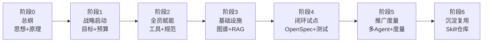
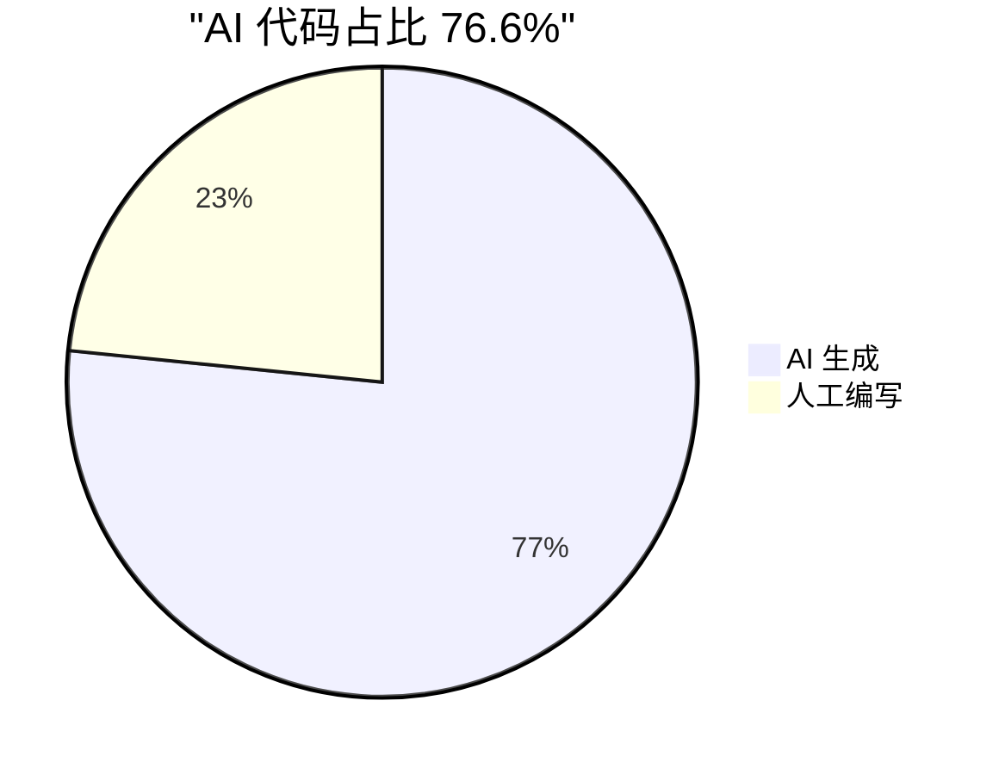

# 企业级 AI 提效战略转型方法论 · 实践教程

> 从「思想转变」到「全员 AI 提效」的完整路径——一套经过 80+ 人研发团队实战验证的方法论，配套可运行 demo、角色手册、汇报模板。跟着做，是 AI 时代最值得的投资。

<div align="center">

      

</div>

## 这是什么

一套**企业级 AI 提效战略转型的完整方法论教程**：把「拥抱 AI」这句口号，拆成 **7 个可落地、可度量、可复制的阶段**——总纲（思想+原理）→ 战略启动 → 全员赋能 → 基础设施 → 闭环试点 → 推广度量 → 沉淀复用。每一步都告诉你**做什么、怎么做、产出什么、用什么工具、下一步去哪**。



不只是讲道理——配套 **7 个 demo 与资产包**：3 个可直接运行（AI 自动化测试框架、AI 代码度量、AI RAG 端到端），4 个拿来即用的资产（汇报材料 Prompt 包、角色操作手册、Claude Code skill 仓库、多 Agent 并行编排 skill）。

## 为什么做

AI 不是噱头，是**研发生产关系的重写**。先动的人，用同样人数产出 2 倍代码；不动的，不是维持现状，而是**相对落后**。

但「全员上 AI」如果没有方法论，会一团乱：有人抢跑、有人观望、规范各搞各的、效果无法衡量、向上汇报拿不出数据。这套教程把「乱糟糟的转型」变成「有路线图、有度量、有产出的工程」——让转型从玄学变成科学。

## 效果（真实团队实战）

某 80+ 人研发团队、千万级用户平台，按这套方法论 3 个月跑出的结果：

| 指标 | 转型前 | 转型后 | 变化 |
|---|---|---|---|
| 📈 人均代码产出 | 基准 | **+104%** | 🚀 翻倍（人数 -9% 反而翻倍）|
| 🤖 AI 代码占比 | ~0% | **76.6%** | 🆕 从无到有（简单 CRUD ~90%）|
| 🐛 Bug 占比 | 38.5% | **22.1%** | 📉 -16.4 个百分点 |
| ⚡ 测试用例生成 | 4-8h | **10-30min** | ⚡ 5-10 倍 |



> 这些是转型前后的对比观察，不能 100% 都归功于 AI（需求、人员变动也有影响），但量级足以说明：**上 AI 和明显提效强相关**。数据来自度量工具的事后统计（推进过程中看不到）——别拿它当启动期的承诺，它是转型跑完的成果。

## 跟着做，你能得到什么

**这是 AI 时代最值得的投资**——无论对个人，还是对职业。

### 个人：能力升级，不被替代
AI 不是替代你，是**扩展你的能力边界**。跟着做，你会从「写代码」升级到「定义问题 + 设计架构 + 审查验证 + 沉淀知识」——这是 AI 时代开发者的新价值位。一个懂业务、懂原理、会精准驾驭 AI 的人，配上 AI 能放大 10 倍；不懂的人，AI 再强也用不起来、用不对。

### 职业：带团队完成转型 = 升职加薪的硬资本
「我带着研发中心完成了 AI 提效转型，人均产出翻倍、成本下降」——这是**用数据说话的硬业绩**。这套教程给你完整的转型路径 + 汇报材料（战略汇报 PPT / 转型计划书 / 效果度量报告），让你既能**做出来**，又能**讲清楚**。做到的人，就是公司里推动变革的那个人——升职加薪自然来。

## 项目结构

```
ai-landing-tutorial/
├── index.html              # 首页入口（从这里开始）
├── pages/                  # 教程页面（统一管理）
│   ├── stage0.html         # 总纲：思想转变 + AI 原理
│   ├── stage1-6.html       # 实施六阶段（战略→赋能→设施→试点→度量→沉淀）
│   └── appendix.html       # 附录（术语表 / 源码索引 / 技术栈）
├── assets/
│   ├── css/                # 样式
│   ├── images/             # 图片（PPT 效果 / 二维码 / 图表）
│   └── ref/                # 深度参考文档（7 篇）
└── demos/                  # 可运行 demo + 资产包
    ├── ai-test-frame/      # AI 自动化测试框架（python main.py 即跑）
    ├── ai-metrics/         # AI 代码占比度量（三层识别算法 + Excel 模板）
    ├── report-templates/   # 5 类汇报 Prompt 包 + ppt-master 渲染 PPT
    ├── role-handbooks/     # 4 份角色手册（开发 / 测试 / 组长 / 产品）
    ├── claude-skills/      # Claude Code skill + 团队规范仓库
    ├── agent-teams/        # 多 Agent 并行编排 skill（6 步流程 / Swarm / 跨项目）
    └── rag-service/        # AI RAG 端到端（zvec 三级递进 + 评估）
```

## 怎么开始

1. **打开 `index.html`**——首页有整体导览 + 核心术语速查
2. **按阶段走**：stage0 总纲（思想 + 原理）→ stage1 战略启动 → ... → stage6 沉淀复用
3. **按角色拿手册**：开发 / 测试 / 组长 / 产品，各读各的（`demos/role-handbooks/`），不用通读全教程
4. **边做边用 demo**：
   - 度量 AI 效果 → `demos/ai-metrics`
   - 写汇报材料 → `demos/report-templates`
   - 做自动化测试 → `demos/ai-test-frame`
   - 沉淀团队规范 / skill → `demos/claude-skills`
   - 多 Agent 并行编排 → `demos/agent-teams`

## 适合谁

- **技术负责人 / 研发 Leader**：要主导团队 AI 转型、向上争取资源、向下推动落地
- **想转型的开发 / 测试 / 组长 / 产品**：想知道自己在 AI 时代该干什么、怎么干
- **企业决策者**：想看清 AI 转型怎么做、效果如何、值不值得投

## 关于

作者 **Johnson** · 技术总监 / 首席架构师 · B站技术 UP主。

这套方法论提炼自真实团队的 AI 转型实践——80+ 人研发团队、3 个月、人均产出 +104%。去粗取精、系统化成可复制的方法论 + 可运行的工具，让每个团队都能少走弯路。

> 如果你正在推动团队 AI 转型，欢迎交流——这套方法论就是为实践者写的。

---

## 支持这个项目

这套教程是我利用业余时间整理的免费开源内容。如果你觉得它有用，可以支持一下 — 完全是自愿的。

你的支持能帮我：
- 📹 持续产出 12 集视频合集（录制 / 剪辑 / 动画都需要时间）
- 🔧 迭代更多 demo 和 skill（claude-skills 仓库持续扩充）
- ☕ 腾出更多业余时间完善教程和答疑

| 方式 | 说明 |
|---|---|
| ⭐ **GitHub Star** | 最简单的支持——点个 Star 让更多人看到 |
| 🔔 **B站关注 + 充电** | 12 集视频合集在 B站发布，充电支持持续创作 |
| 💬 **分享给同事** | 转发给你的团队 Leader / 技术负责人，让更多人受益 |

<div align="center">

| 支付宝 | 微信 |
|:---:|:---:|
|  |  |

</div>

感谢每一位支持者 ❤️

---

⭐ 如果这套教程对你有帮助，**跟着做起来**——AI 时代最好的投资，是投资自己驾驭 AI 的能力。从 `index.html` 开始，一步一步，把转型变成你的硬业绩。

## 许可证

[MIT License](LICENSE) — 教程内容 + demo 代码均可自由使用、修改、分发。
